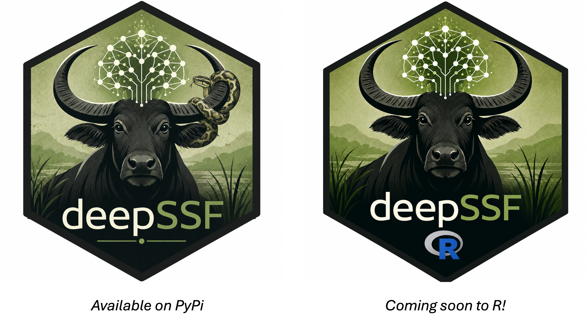

This repository builds the website at [https://swforrest.github.io/deepSSF/](https://swforrest.github.io/deepSSF/), and has the code for the paper '**Predicting animal movement with deepSSF: a deep learning step selection framework**'. The citation for the paper is:

Forrest, S. W., Pagendam, D., Hassan, C., Potts, J. R., Drovandi, C., Bode, M., & Hoskins, A. J. (2026). **Predicting animal movement with deepSSF : A deep learning step selection framework**. Methods in Ecology and Evolution, 17(2), 371–391. [https://doi.org/10.1111/2041-210x.70136](https://doi.org/10.1111/2041-210x.70136).

The Python package can be viewed on GitHub [https://github.com/swforrest/deepSSF_package](https://github.com/swforrest/deepSSF_package) and PyPi [https://pypi.org/project/deepSSF/](https://pypi.org/project/deepSSF/).

We are also currently developing an R package, which will be a reticulate wrapper around the functions in the Python package. Currently, it is only available in Python.