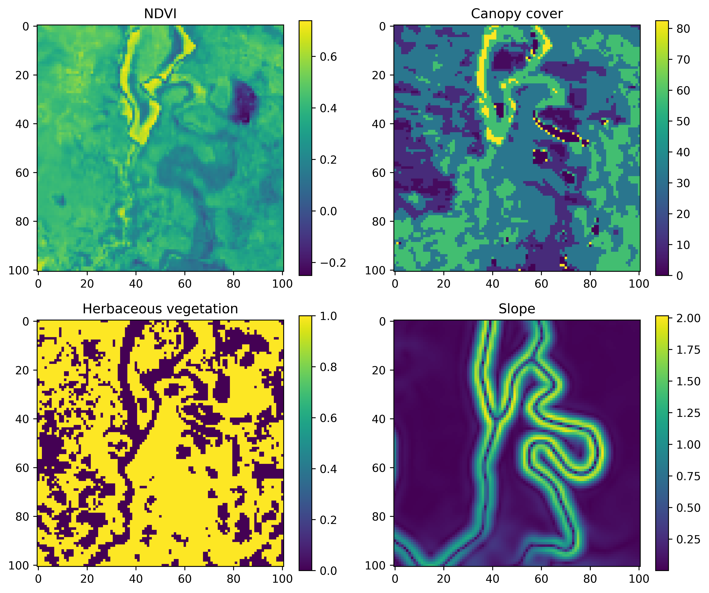
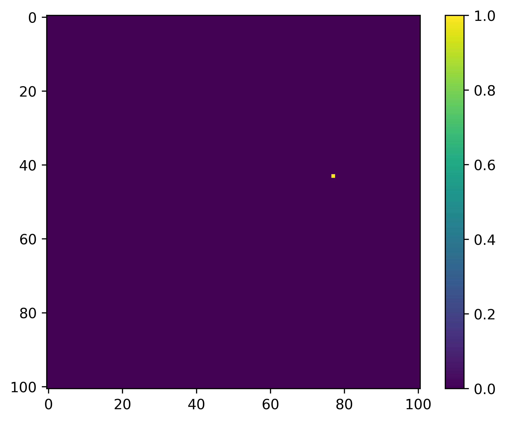

## UPDATE (27th May 2026) 

We have updated the data preparation process to avoid the need to crop out and save individual availability layers for each step. Now, individual availability layers are generated on-the-fly during the training process in Python. This functionality is incorporated into the Python package see here - [https://github.com/swforrest/deepSSF_package](https://github.com/swforrest/deepSSF_package) and here - [https://pypi.org/project/deepSSF/](https://pypi.org/project/deepSSF/). Now, a script can just recieve a csv file with a timestamp, and lat and lon coordinates for each step, and the full raster layers that cover the trajectory. This avoids the need to use R for any data preparation, and is much better as all of the local layers for every step don't need to be stored in RAM, but are generated for every training batch.

We have left the previous code here for now, as it is still helpful to understand what the model is processing during training. Every step is associated with a set of local availability layers (one for each covariate) that are centred on the current step, and a target layer that has a value of 1 at the location of the next step and 0 everywhere else. The model is trained with convolution layers to predict the target layer from the local availability layers (through generating a habitat selection probability surface). The code in the Python package does exactly the same thing, but generates the local availability layers on-the-fly during training, which is much more efficient and avoids the need to use R for data preparation.

---

## Data Preparation

To train the deepSSF model, we need to crop out local layers for each of our covariates at every observed step in the trajectory. These local layers must be centred on the current step (as the movement kernel is centred on the centre cell), and the next step becomes our 'target'.

An example for a single step may look something like the image below, where we have a local covariate that is 101 x 101 cells (an odd number so we have a central cell) that are 25 m x 25 m each, resulting in a map that is 2525 m x 2525 m. This is a distance of 1262.5 m to the nearest edge from the central cell, which covers about 97% of the observed step lengths.

What we are trying to predict, or the 'target', is the location of the next step, which might look something like this:

Therefore, for each step we need the cropped out 'local' layers, which are 101 x 101 cells with the current location in the centre, and the target, which is the location of the next step. Once we have those for every step we are ready to start training the deep learning model. We also want the temporal covariates, but these we just save in a dataframe, which we turn into grids for training during the [deepSSF_train](Python/deepSSF_train.ipynb) scripts.

We save the local spatial layers as one stack per covariate, with a layer for each step. So if we had layers for NDVI and slope that we wanted to use as covariates, and there were 1,000 steps in the trajectory, we would save a raster stack object for NDVI with 1,000 layers, one for slope with 1,000 layers, and then another stack with 1,000 layers for the target (which has values of 0 everywhere except at the location of the next step, which is 1).

When we import these raster stacks into Python we turn them into NumPy arrays and then turn them into PyTorch tensors (which are required for training the model using PyTorch), and stack the covariates together along a different dimension that represents each of the covariates, ready for training.

Another option is to save every local layers for each covariate separately, and have the filenames stored in a dataframe, with a column for each of the covariates. This setup is a more common approach for importing image data for training deep learning models, and we may opt for this in future applications of the approach, particularly when there is more data as the raster objects can be quite large.

# Scripts

There is a script for preparing the data using 'derived' covariates (NDVI, canopy cover, herbaceous vegetation and slope), and a script for preparing data using Sentinel-2 imagery, which has 12 Sentinel-2 bands, as well as slope. We could have cropped out the local layers for all of the covariates (derived + Sentinel-2) in a single script, although each one takes a while to run, so we thought it best to keep them separate in case all layers aren't needed (it should be straightforward to add in your own layers).

Both of the data preparation scripts are written in R.